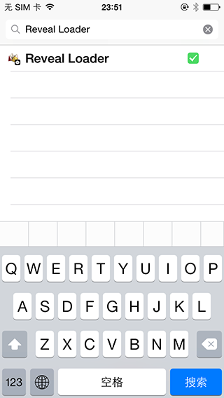

##  LANRevealLoader

LANRevealLoader用来在越狱环境下加载RevealServer。由于在Reveal2版本以后，Reveal移除了动态库（libReveal.dyilb），而改用了静态库（RevealServer.framework）。但是Mobile Substrate需要使用动态库才能正确得注入到目标应用中，这部分的原因自行脑补关于动态库与静态库的区别。

在iOS11以前，还可以使用Cydia中的Reveal Loader加载RevealServer，但由于Cydia在iOS11中的表现导致Cydia中的Reveal Loader无法正常安装。

LANRevealLoader简化了Reveal Loader，并在iOS11中能够正常加载RevealServer，LANRevealLoader由三部分组成：

* LANRevealLoader.dylib：用于加载RevealServer
* LANRevealLoader.plist：用于指定注入Target
* RevealServer：从RevealServer.framework/RevealServer中获得的文件

Loader与Server分开的好处显而易见，不同的Reveal版本只要替换不同的RevealServer就可以了，而不需要再次编译生成类似于libReveal.dylib动态库。

## Install

从RevealServer.framework/RevealServer获取RevealServer，并下载LANRevealLoader，解压后将LANRevealLoader.dylib、LANRevealLoader.plist、RevealServer放在已越狱iOS的/Library/MobileSubstrate/DynamicLibraries目录下。